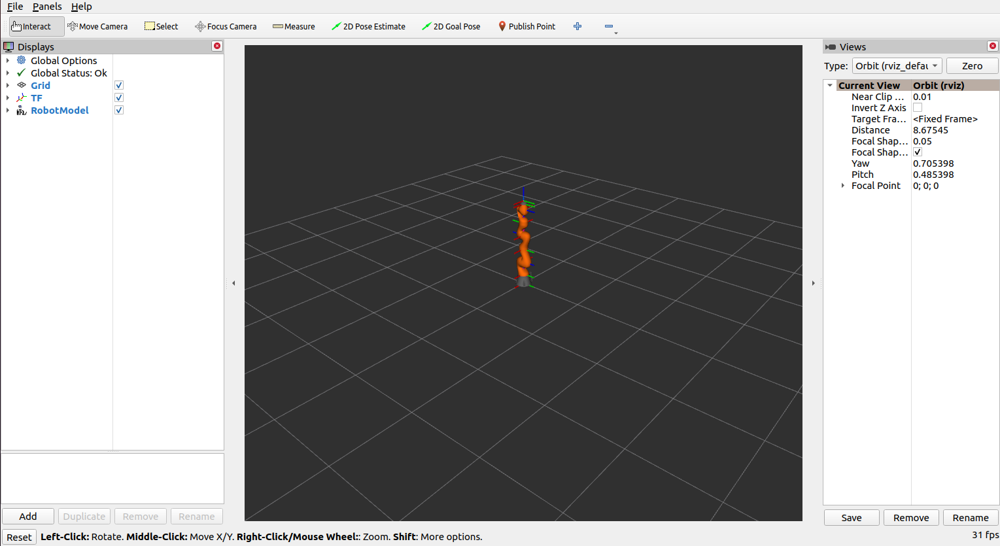
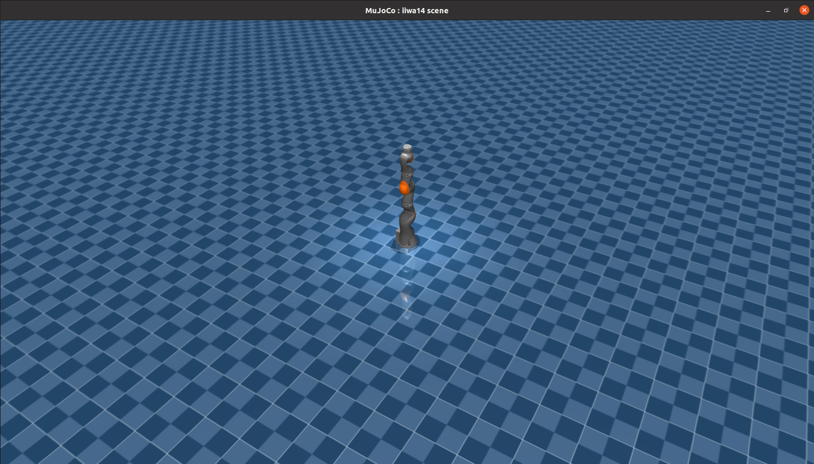

# Teleoperation

## Introduction

Teleoperation of the manipulator via Hessian Matrix's stereo camera

## Installation

### Source code

The source code is hosted on GitHub: [Ragtime-LAB/teleoperation](https://github.com/Ragtime-LAB/teleoperation)

```commandline
# Clone teleoperation
git clone --recurse-submodules git@github.com:Ragtime-LAB/Ragtime_Panthera.git
```

### Build

Build the source code of `teleoperation` by:

```commandline
colcon build
```

## Quick Start

```commandline
ros2 launch teleoperation iiwa_teleoperation.launch.py
```

- press `enter` to move the joints to the ready position
- press `space` to toggle teleoperation on or off

You can see the RVIZ UI like this:



You can see the MuJoCo UI like this:


